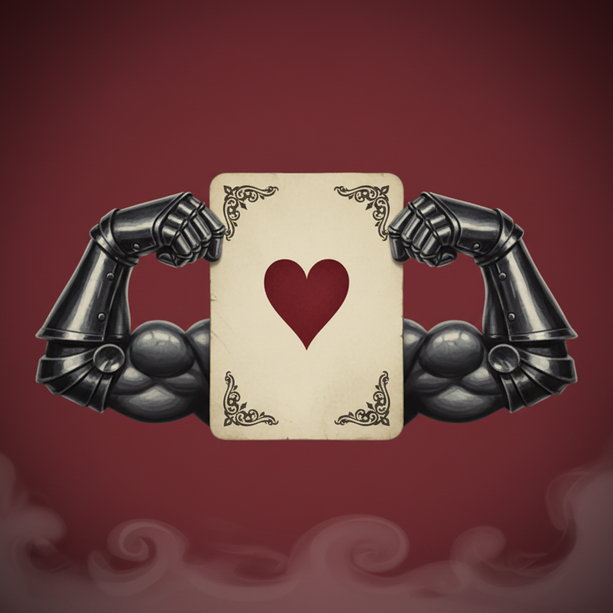

<div align="center">



# MySkat

**Skat-AMRAP-Timer für die CrossFit August-Challenge**

[myskat.hubig.it](https://myskat.hubig.it)

</div>

---

Ein 32-Blatt-Skat-Deck bestimmt die Übungen, ein 10-Minuten-Timer läuft gnadenlos:
Karte antippen, wenn die Übung geschafft ist — nächste Karte. Ziel ist es,
mindestens das ganze Deck durchzuspielen. Die Kartenmotive sind muskelbepackte
Kartensoldaten im Stil von Tim Burtons Alice im Wunderland.

## Die Regeln

| Karte | Bedeutung |
|---|---|
| ♥ Herz | Push-Ups |
| ♦ Karo | Jumping Jacks |
| ♠ Pik | Crunches |
| ♣ Kreuz | Air Squats |
| **Bube** | **15 Burpees** — egal welche Farbe |
| 7–10 | Wiederholungen = Kartenwert |
| Dame | 12 Wiederholungen |
| König | 13 Wiederholungen |
| Ass | 1 Wiederholung |

Ist das Deck vor Ablauf der 10 Minuten durch, geht es in derselben Reihenfolge
in die nächste Deck-Runde — wie mit echten Karten, zum Neumischen hat ja
niemand Zeit ([warum?](docs/adr/0001-deck-wiederholt-sich-in-fester-reihenfolge.md)).

## Features

- **10-Minuten-AMRAP** mit automatischem Mischen, Misch-Animation und Countdown
- **Fortschrittsanzeige**: Karte X/32 und aktuelle Deck-Runde
- **Signal bei Rundenende und Timer-Ablauf** (Ton + Vibration), Wake Lock hält das Display an
- **Statistik** im Browser (localStorage): Workouts, Bestwert, Reps pro Übung
- **PWA**: vom Homescreen installierbar, funktioniert komplett offline
- Der Timer rechnet mit fester Endzeit — Tab-Wechsel und Reloads überlebt er

## Technik

Vanilla HTML/CSS/JS ohne Build-Step und ohne Dependencies — deployt wird der
`main`-Branch direkt über GitHub Pages. Details in [CLAUDE.md](CLAUDE.md),
Fachbegriffe in [CONTEXT.md](CONTEXT.md).

Lokal entwickeln:

```bash
python3 -m http.server 8000
# http://localhost:8000?t=15  → Timer auf 15 Sekunden verkürzt (zum Testen)
```

## Credits

- Kartenmotive und Icon: generiert mit Google Gemini
  (Prompts in [docs/gemini-image-prompt.md](docs/gemini-image-prompt.md))
- Schrift: [Pirata One](https://fonts.google.com/specimen/Pirata+One) (SIL Open Font License)
- Challenge-Idee: die Coaches des CrossFit-Clubs 🖤
